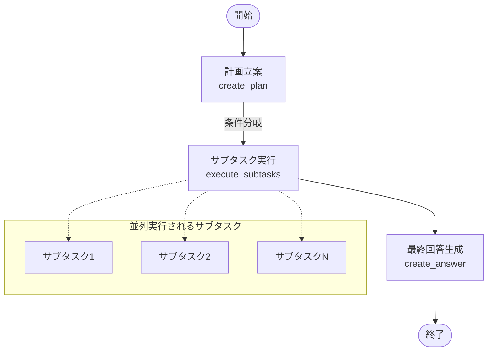
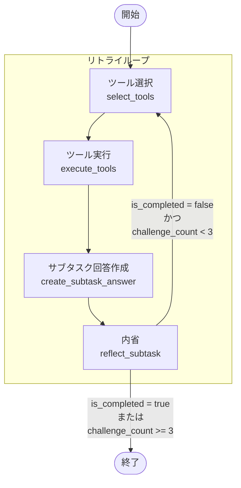
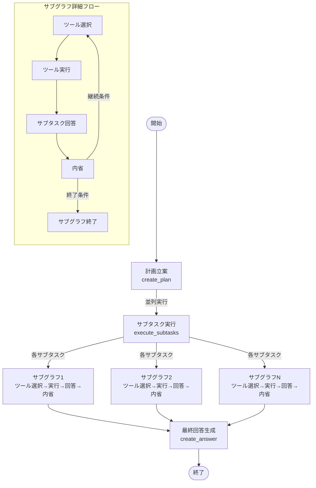

# HelpDeskAgent 詳細設計書

## 1. 概要

### 1.1 目的
`HelpDeskAgent`は、XYZシステムのヘルプデスク機能を提供するAIエージェントです。ユーザーの質問に対して、計画立案→サブタスク実行→最終回答生成の流れで、構造化された回答を提供します。

### 1.2 主要機能
- **計画立案**: ユーザーの質問を分析し、解決のためのサブタスクを生成
- **サブタスク実行**: 各サブタスクに対してツール選択・実行・回答・内省を繰り返し実行
- **最終回答生成**: 全サブタスクの結果を統合して最終回答を作成

### 1.3 技術スタック
- **フレームワーク**: LangGraph
- **LLM**: OpenAI GPT
- **言語**: Python 3.x
- **データ構造**: Pydantic Models

## 2. アーキテクチャ

### 2.1 全体構成
```
┌─────────────────┐    ┌─────────────────┐    ┌─────────────────┐
│   計画立案       │ -> │  サブタスク実行  │ -> │   最終回答生成   │
│  (create_plan)  │    │ (execute_subtasks)│    │ (create_answer) │
└─────────────────┘    └─────────────────┘    └─────────────────┘
```

### 2.2 サブタスク実行フロー
```
┌─────────────────┐    ┌─────────────────┐    ┌─────────────────┐    ┌─────────────────┐
│   ツール選択     │ -> │   ツール実行     │ -> │  サブタスク回答  │ -> │     内省        │
│ (select_tools)  │    │ (execute_tools) │    │(create_subtask_answer)│ │(reflect_subtask)│
└─────────────────┘    └─────────────────┘    └─────────────────┘    └─────────────────┘
         ↑                                                                      │
         └─────────────────── 条件分岐 (continue/end) ──────────────────────────┘
```

## 3. データモデル

### 3.1 状態管理

#### AgentState (メイングラフの状態)
```python
class AgentState(TypedDict):
    question: str                                    # ユーザーの質問
    plan: list[str]                                  # 生成された計画
    current_step: int                               # 現在のステップ
    subtask_results: Annotated[Sequence[Subtask], operator.add]  # サブタスク結果
    last_answer: str                                # 最終回答
```

#### AgentSubGraphState (サブグラフの状態)
```python
class AgentSubGraphState(TypedDict):
    question: str                                    # ユーザーの質問
    plan: list[str]                                 # 生成された計画
    subtask: str                                    # 現在のサブタスク
    is_completed: bool                              # 完了フラグ
    messages: list[ChatCompletionMessageParam]       # 対話履歴
    challenge_count: int                             # 挑戦回数
    tool_results: Annotated[Sequence[Sequence[SearchOutput]], operator.add]  # ツール結果
    reflection_results: Annotated[Sequence[ReflectionResult], operator.add]  # 内省結果
    subtask_answer: str                             # サブタスク回答
```

### 3.2 データ構造

#### Plan
```python
class Plan(BaseModel):
    subtasks: list[str] = Field(..., description="問題を解決するためのサブタスクリスト")
```

#### Subtask
```python
class Subtask(BaseModel):
    task_name: str                                  # サブタスクの名前
    tool_results: list[list[ToolResult]]           # ツール実行結果
    reflection_results: list[ReflectionResult]      # 内省結果
    is_completed: bool                             # 完了フラグ
    subtask_answer: str                            # サブタスク回答
    challenge_count: int                            # 挑戦回数
```

#### ToolResult
```python
class ToolResult(BaseModel):
    tool_name: str                                  # ツール名
    args: str                                       # 引数
    results: list[SearchOutput]                    # 検索結果
```

#### ReflectionResult
```python
class ReflectionResult(BaseModel):
    advice: str                                     # 改善アドバイス
    is_completed: bool                              # 完了評価
```

## 4. 主要メソッド

### 4.1 計画立案 (`create_plan`)

**目的**: ユーザーの質問を分析し、解決のためのサブタスクを生成

**処理フロー**:
1. システムプロンプトとユーザープロンプトを生成
2. OpenAI APIにStructured Output形式でリクエスト送信
3. `Plan`オブジェクトを取得し、サブタスクリストを返す

**入力**: `AgentState`
**出力**: `{"plan": plan.subtasks}`

### 4.2 ツール選択 (`select_tools`)

**目的**: サブタスク実行に適したツールを選択

**処理フロー**:
1. LangChainツールをOpenAI形式に変換
2. 初回実行時は通常プロンプト、リトライ時は過去の対話履歴を使用
3. OpenAI APIにツール選択リクエスト送信
4. 選択されたツールの呼び出し情報を返す

**入力**: `AgentSubGraphState`
**出力**: `{"messages": messages}`

### 4.3 ツール実行 (`execute_tools`)

**目的**: 選択されたツールを実行し、結果を取得

**処理フロー**:
1. 最後のメッセージからツール呼び出し情報を取得
2. 各ツールを順次実行
3. 実行結果を`ToolResult`として保存
4. 対話履歴にツール結果を追加

**入力**: `AgentSubGraphState`
**出力**: `{"messages": messages, "tool_results": [tool_results]}`

### 4.4 サブタスク回答作成 (`create_subtask_answer`)

**目的**: ツール実行結果からサブタスクの回答を生成

**処理フロー**:
1. 対話履歴をOpenAI APIに送信
2. 生成された回答を取得
3. 対話履歴に回答を追加

**入力**: `AgentSubGraphState`
**出力**: `{"messages": messages, "subtask_answer": subtask_answer}`

### 4.5 内省 (`reflect_subtask`)

**目的**: サブタスク回答の品質を評価し、必要に応じて改善アドバイスを提供

**処理フロー**:
1. 内省プロンプトを対話履歴に追加
2. OpenAI APIにStructured Output形式でリクエスト送信
3. `ReflectionResult`を取得
4. 完了フラグと挑戦回数を更新
5. 最大挑戦回数に達した場合は強制終了

**入力**: `AgentSubGraphState`
**出力**: `{"messages": messages, "reflection_results": [reflection_result], "challenge_count": challenge_count + 1, "is_completed": is_completed}`

### 4.6 最終回答作成 (`create_answer`)

**目的**: 全サブタスクの結果を統合して最終回答を生成

**処理フロー**:
1. サブタスク結果からタスク名と回答を抽出
2. システムプロンプトとユーザープロンプトを生成
3. OpenAI APIにリクエスト送信
4. 最終回答を生成

**入力**: `AgentState`
**出力**: `{"last_answer": response.choices[0].message.content}`

## 5. グラフ構成

### 5.1 メイングラフ (`create_graph`)



**実装コード**:
```python
workflow = StateGraph(AgentState)

# ノード追加
workflow.add_node("create_plan", self.create_plan)
workflow.add_node("execute_subtasks", self._execute_subgraph)
workflow.add_node("create_answer", self.create_answer)

# エッジ追加
workflow.add_edge(START, "create_plan")
workflow.add_conditional_edges("create_plan", self._should_continue_exec_subtasks)
workflow.add_edge("execute_subtasks", "create_answer")
workflow.set_finish_point("create_answer")
```

### 5.2 サブグラフ (`_create_subgraph`)



**実装コード**:
```python
workflow = StateGraph(AgentSubGraphState)

# ノード追加
workflow.add_node("select_tools", self.select_tools)
workflow.add_node("execute_tools", self.execute_tools)
workflow.add_node("create_subtask_answer", self.create_subtask_answer)
workflow.add_node("reflect_subtask", self.reflect_subtask)

# エッジ追加
workflow.add_edge(START, "select_tools")
workflow.add_edge("select_tools", "execute_tools")
workflow.add_edge("execute_tools", "create_subtask_answer")
workflow.add_edge("create_subtask_answer", "reflect_subtask")
workflow.add_conditional_edges("reflect_subtask", self._should_continue_exec_subtask_flow, {"continue": "select_tools", "end": END})
```

### 5.3 全体フロー統合図



## 6. 条件分岐ロジック

### 6.1 サブタスク実行継続判定 (`_should_continue_exec_subtasks`)

**目的**: 計画の各サブタスクを並列実行するためのSendオブジェクトを生成

**ロジック**:
```python
return [
    Send("execute_subtasks", {
        "question": state["question"],
        "plan": state["plan"],
        "current_step": idx,
    })
    for idx, _ in enumerate(state["plan"])
]
```

### 6.2 サブタスクフロー継続判定 (`_should_continue_exec_subtask_flow`)

**目的**: サブタスクの内省結果に基づいて継続/終了を判定

**ロジック**:
```python
if state["is_completed"] or state["challenge_count"] >= MAX_CHALLENGE_COUNT:
    return "end"
else:
    return "continue"
```

## 7. 設定とプロンプト

### 7.1 設定 (`Settings`)

```python
class Settings(BaseSettings):
    openai_api_key: str      # OpenAI APIキー
    openai_api_base: str     # OpenAI APIベースURL
    openai_model: str        # 使用するモデル名
```

### 7.2 プロンプト管理 (`HelpDeskAgentPrompts`)

- **計画立案プロンプト**: サブタスク生成のためのシステム・ユーザープロンプト
- **サブタスク実行プロンプト**: ツール選択・実行・回答・内省のためのプロンプト
- **最終回答プロンプト**: 最終回答生成のためのプロンプト

## 8. エラーハンドリング

### 8.1 例外処理

各メソッドで以下の例外処理を実装:

```python
try:
    response = self.client.chat.completions.create(...)
except Exception as e:
    logger.error(f"Error during OpenAI request: {e}")
    raise
```

### 8.2 バリデーション

- ツール呼び出しがNoneの場合の`ValueError`発生
- 内省結果がNoneの場合の`ValueError`発生
- 最大挑戦回数（`MAX_CHALLENGE_COUNT = 3`）の制限

## 9. ログ機能

### 9.1 ログ設定

```python
logger = setup_logger(__file__)
```

### 9.2 ログレベル

- **INFO**: 処理開始・完了の通知
- **DEBUG**: 詳細な処理内容
- **ERROR**: エラー発生時の通知

## 10. 実行フロー

### 10.1 メイン実行 (`run_agent`)

```python
def run_agent(self, question: str) -> AgentResult:
    app = self.create_graph()
    result = app.invoke({
        "question": question,
        "current_step": 0,
    })
    return AgentResult(
        question=question,
        plan=Plan(subtasks=result["plan"]),
        subtasks=result["subtask_results"],
        answer=result["last_answer"],
    )
```

### 10.2 実行順序

1. **初期化**: `HelpDeskAgent`インスタンス作成
2. **計画立案**: ユーザー質問からサブタスク生成
3. **サブタスク実行**: 各サブタスクを並列実行
4. **最終回答生成**: 全結果を統合して回答作成
5. **結果返却**: `AgentResult`オブジェクトで返却

## 11. 拡張性

### 11.1 ツール追加

新しいツールを追加する場合:
1. ツールクラスを実装
2. `HelpDeskAgent`のコンストラクタでツールリストに追加
3. `tool_map`に自動登録

### 11.2 プロンプトカスタマイズ

`HelpDeskAgentPrompts`クラスを継承してプロンプトをカスタマイズ可能

### 11.3 設定拡張

`Settings`クラスに新しい設定項目を追加可能

## 12. パフォーマンス考慮事項

### 12.1 並列実行

サブタスクは並列実行されるため、複数のサブタスクがある場合の処理時間短縮

### 12.2 トークン節約

リトライ時の対話履歴からツール関連メッセージを除外してトークン数を削減

### 12.3 最大挑戦回数制限

無限ループを防ぐため、サブタスクごとに最大3回まで挑戦を制限

## 13. 依存関係

### 13.1 外部ライブラリ

- `langchain_core`: ツール変換機能
- `langgraph`: グラフ実行フレームワーク
- `openai`: OpenAI APIクライアント
- `pydantic`: データモデル定義

### 13.2 内部モジュール

- `src.configs`: 設定管理
- `src.custom_logger`: ログ機能
- `src.models`: データモデル
- `src.prompts`: プロンプト管理

## 14. テスト考慮事項

### 14.1 単体テスト

各メソッドの単体テストが必要:
- 正常系の動作確認
- 異常系のエラーハンドリング確認
- 境界値テスト

### 14.2 統合テスト

- エンドツーエンドの実行フロー確認
- 異なる質問パターンでの動作確認
- エラー時の復旧動作確認

### 14.3 モック

- OpenAI APIのモック化
- ツール実行のモック化
- 外部依存関係のモック化
