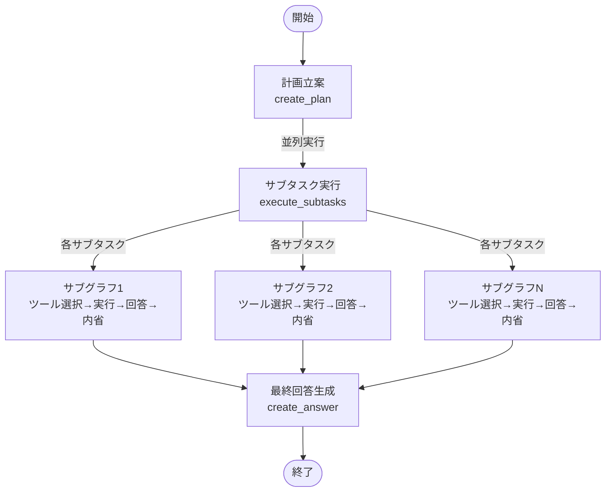
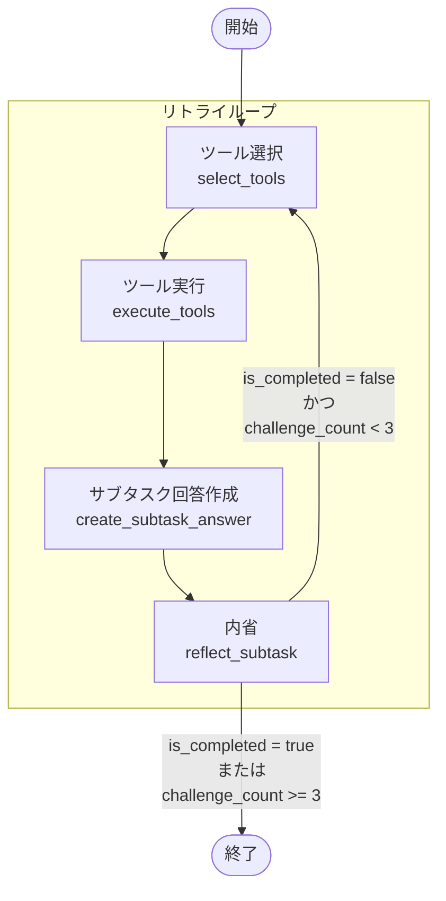

# XYZシステム ヘルプデスクエージェント 機能設計書

## 1. システム概要

### 1.1 システム名
XYZシステム ヘルプデスクエージェント

### 1.2 システム目的
XYZシステムのユーザーからの質問に対して、AIエージェントが自動的に適切な回答を提供するシステム

### 1.3 システム構成
```
┌─────────────────┐    ┌─────────────────┐    ┌─────────────────┐
│   ユーザー       │ -> │  ヘルプデスク    │ -> │   回答提供       │
│   (質問入力)     │    │   エージェント   │    │   (回答出力)     │
└─────────────────┘    └─────────────────┘    └─────────────────┘
```

## 2. 機能構成

### 2.1 機能階層図

```
XYZシステム ヘルプデスクエージェント
├── 質問受付機能
├── 計画立案機能
├── サブタスク実行機能
│   ├── ツール選択機能
│   ├── ツール実行機能
│   ├── サブタスク回答作成機能
│   └── 内省機能
├── 最終回答生成機能
├── 検索機能
│   ├── マニュアル検索機能
│   └── QA検索機能
└── プロンプト管理機能
```

### 2.2 主要機能の詳細

#### 2.2.1 質問受付機能

**機能概要**
ユーザーからの自然言語による質問を受け付け、システム内で処理可能な形式に変換する。

**処理フロー**
1. 質問文の受付
2. 入力値の検証
3. 前処理（文字列の正規化など）
4. 後続処理への引き渡し

**入力**
- 質問文（文字列、最大1000文字）

**出力**
- 正規化された質問文

**エラーハンドリング**
- 空文字列の場合：エラーメッセージを返す
- 文字数超過の場合：切り詰めて警告メッセージを表示

#### 2.2.2 計画立案機能

**機能概要**
受けた質問を分析し、回答作成のためのサブタスクを生成する。

**処理フロー**
1. 質問の意図分析
2. 必要な情報の特定
3. サブタスクの分解
4. 重複チェック
5. サブタスクリストの生成

**入力**
- 質問文

**出力**
- サブタスクリスト（文字列配列）

**制約事項**
- サブタスクは具体的かつ詳細に記述
- 重複する内容は排除
- 必要最小限のサブタスク数に抑制

**プロンプト設計**
```python
PLANNER_SYSTEM_PROMPT = """
# 役割
あなたはXYZというシステムのヘルプデスク担当者です。
ユーザーの質問に答えるために以下の指示に従って回答作成の計画を立ててください。

# 絶対に守るべき制約事項
- サブタスクはどんな内容について知りたいのかを具体的かつ詳細に記述すること
- サブタスクは同じ内容を調査しないように重複なく構成すること
- 必要最小限のサブタスクを作成すること
"""
```

#### 2.2.3 サブタスク実行機能

**機能概要**
生成されたサブタスクを並列実行し、各サブタスクの回答を作成する。

**処理フロー**
1. サブタスクの並列実行開始
2. 各サブタスクで以下を繰り返し：
   - ツール選択
   - ツール実行
   - サブタスク回答作成
   - 内省による品質評価
   - 必要に応じたリトライ（最大3回）
3. 全サブタスクの完了待ち
4. 結果の統合

**入力**
- サブタスクリスト
- 元の質問文

**出力**
- サブタスク結果リスト

**制約事項**
- 最大挑戦回数：3回
- 各サブタスクは並列実行
- ツール実行結果は最大3件まで取得

**プロンプト設計**
```python
SUBTASK_SYSTEM_PROMPT = """
あなたはXYZというシステムの質問応答のためにサブタスク実行を担当するエージェントです。
回答までの全体の流れは計画立案 → サブタスク実行 [ツール実行 → サブタスク回答 → リフレクション] → 最終回答となります。

1. ツール選択・実行
サブタスク回答のためのツール選択と選択されたツールの実行を行います。
2回目以降はリフレクションのアドバイスに従って再実行してください。

2. サブタスク回答
ツールの実行結果から得られた回答に必要なことは言語化し、最後の回答用エージェントに引き継げるようにしてください。

3. リフレクション
ツールの実行結果と回答から、サブタスクに対して正しく回答できているかを評価します。
"""
```

#### 2.2.4 最終回答生成機能

**機能概要**
全サブタスクの結果を統合して最終回答を作成する。

**処理フロー**
1. サブタスク結果の収集
2. 結果の統合・整理
3. 質問者の意図に応じた回答調整
4. 最終回答の生成

**入力**
- サブタスク結果リスト
- 元の質問文

**出力**
- 最終回答文

**品質要件**
- 質問者の意図を汲み取った丁寧な回答
- 簡潔で明確な内容
- 確定情報のみを使用
- 不確定な情報や推測は含めない

**プロンプト設計**
```python
CREATE_LAST_ANSWER_SYSTEM_PROMPT = """
あなたはXYZというシステムのヘルプデスク回答作成担当です。
回答を作成する際は必ず以下の指示に従って回答を作成してください。

- 回答は実際に質問者が読むものです。質問者の意図や理解度を汲み取り、質問に対して丁寧な回答を作成してください
- 回答は聞かれたことに対して簡潔で明確にすることを心がけてください
- あなたが知り得た情報から回答し、不確定な情報や推測を含めないでください
- 調べた結果から回答がわからなかった場合は、その旨を素直に回答に含めた上で引き続き調査することを伝えてください
"""
```

### 2.3 検索機能の詳細

#### 2.3.1 マニュアル検索機能

**機能概要**
XYZシステムのドキュメントを全文検索する。

**処理フロー**
1. 検索キーワードの受付
2. Elasticsearchへの検索クエリ送信
3. 検索結果の取得（最大3件）
4. SearchOutputオブジェクトへの変換
5. 結果の返却

**入力**
- 検索キーワード（文字列）

**出力**
- SearchOutputオブジェクトリスト

**技術仕様**
- 検索エンジン：Elasticsearch
- インデックス名：documents
- 検索フィールド：content
- 最大結果数：3件

**実装例**
```python
@tool(args_schema=SearchKeywordInput)
def search_xyz_manual(keywords: str) -> list[SearchOutput]:
    """
    XYZシステムのドキュメントを調査する関数。
    エラーコードや固有名詞が質問に含まれる場合は、この関数を使ってキーワード検索を行う。
    """
    es = Elasticsearch("http://localhost:9200")
    index_name = "documents"
    keyword_query = {"query": {"match": {"content": keywords}}}
    response = es.search(index=index_name, body=keyword_query)
    
    outputs = []
    for hit in response["hits"]["hits"][:MAX_SEARCH_RESULTS]:
        outputs.append(SearchOutput.from_hit(hit))
    
    return outputs
```

#### 2.3.2 QA検索機能

**機能概要**
過去の質問回答ペアを類似度検索する。

**処理フロー**
1. 検索クエリの受付
2. OpenAI Embeddings APIでベクトル化
3. Qdrantへの類似度検索クエリ送信
4. 検索結果の取得（最大3件）
5. SearchOutputオブジェクトへの変換
6. 結果の返却

**入力**
- 検索クエリ（文字列）

**出力**
- SearchOutputオブジェクトリスト

**技術仕様**
- ベクトルDB：Qdrant
- コレクション名：documents
- 埋め込みモデル：text-embedding-3-small
- 最大結果数：3件

**実装例**
```python
@tool(args_schema=SearchQueryInput)
def search_xyz_qa(query: str) -> list[SearchOutput]:
    """
    XYZシステムの過去の質問回答ペアを検索する関数。
    """
    qdrant_client = QdrantClient("http://localhost:6333")
    settings = Settings()
    openai_client = OpenAI(api_key=settings.openai_api_key)
    
    query_vector = (
        openai_client.embeddings.create(input=query, model="text-embedding-3-small")
        .data[0]
        .embedding
    )
    
    search_results = qdrant_client.query_points(
        collection_name="documents", query=query_vector, limit=MAX_SEARCH_RESULTS
    ).points
    
    outputs = []
    for point in search_results:
        outputs.append(SearchOutput.from_point(point))
    
    return outputs
```

## 3. データモデル設計

### 3.1 主要データ構造

#### 3.1.1 SearchOutput
```python
class SearchOutput(BaseModel):
    file_name: str = Field(description="The file name")
    content: str = Field(description="The content of the file")
```

#### 3.1.2 Plan
```python
class Plan(BaseModel):
    subtasks: list[str] = Field(..., description="問題を解決するためのサブタスクリスト")
```

#### 3.1.3 ToolResult
```python
class ToolResult(BaseModel):
    tool_name: str = Field(..., description="ツールの名前")
    args: str = Field(..., description="ツールの引数")
    results: list[SearchOutput] = Field(..., description="ツールの結果")
```

#### 3.1.4 ReflectionResult
```python
class ReflectionResult(BaseModel):
    advice: str = Field(..., description="改善アドバイス")
    is_completed: bool = Field(..., description="完了評価")
```

#### 3.1.5 Subtask
```python
class Subtask(BaseModel):
    task_name: str = Field(..., description="サブタスクの名前")
    tool_results: list[list[ToolResult]] = Field(..., description="サブタスクの結果")
    reflection_results: list[ReflectionResult] = Field(..., description="サブタスクの評価結果")
    is_completed: bool = Field(..., description="サブタスクが完了しているかどうか")
    subtask_answer: str = Field(..., description="サブタスクの回答")
    challenge_count: int = Field(..., description="サブタスクの挑戦回数")
```

#### 3.1.6 AgentResult
```python
class AgentResult(BaseModel):
    question: str = Field(..., description="ユーザーの元の質問")
    plan: Plan = Field(..., description="エージェントの計画")
    subtasks: list[Subtask] = Field(..., description="サブタスクのリスト")
    answer: str = Field(..., description="最終的な回答")
```

### 3.2 状態管理

#### 3.2.1 AgentState（メイングラフ）
```python
class AgentState(TypedDict):
    question: str                                    # ユーザーの質問
    plan: list[str]                                  # 生成された計画
    current_step: int                               # 現在のステップ
    subtask_results: Annotated[Sequence[Subtask], operator.add]  # サブタスク結果
    last_answer: str                                # 最終回答
```

#### 3.2.2 AgentSubGraphState（サブグラフ）
```python
class AgentSubGraphState(TypedDict):
    question: str                                    # ユーザーの質問
    plan: list[str]                                 # 生成された計画
    subtask: str                                    # 現在のサブタスク
    is_completed: bool                              # 完了フラグ
    messages: list[ChatCompletionMessageParam]       # 対話履歴
    challenge_count: int                             # 挑戦回数
    tool_results: Annotated[Sequence[Sequence[SearchOutput]], operator.add]  # ツール結果
    reflection_results: Annotated[Sequence[ReflectionResult], operator.add]  # 内省結果
    subtask_answer: str                             # サブタスク回答
```

## 4. プロンプト設計

### 4.1 プロンプト管理クラス

```python
class HelpDeskAgentPrompts:
    def __init__(
        self,
        planner_system_prompt: str = PLANNER_SYSTEM_PROMPT,
        planner_user_prompt: str = PLANNER_USER_PROMPT,
        subtask_system_prompt: str = SUBTASK_SYSTEM_PROMPT,
        subtask_tool_selection_user_prompt: str = SUBTASK_TOOL_EXECUTION_USER_PROMPT,
        subtask_reflection_user_prompt: str = SUBTASK_REFLECTION_USER_PROMPT,
        subtask_retry_answer_user_prompt: str = SUBTASK_RETRY_ANSWER_USER_PROMPT,
        create_last_answer_system_prompt: str = CREATE_LAST_ANSWER_SYSTEM_PROMPT,
        create_last_answer_user_prompt: str = CREATE_LAST_ANSWER_USER_PROMPT,
    ) -> None:
        # 各プロンプトの初期化
```

### 4.2 プロンプトの種類と用途

#### 4.2.1 計画立案プロンプト
- **システムプロンプト**: ヘルプデスク担当者としての役割定義
- **ユーザープロンプト**: 質問文の入力

#### 4.2.2 サブタスク実行プロンプト
- **システムプロンプト**: サブタスク実行エージェントの役割定義
- **ツール選択プロンプト**: ツール選択・実行の指示
- **内省プロンプト**: リフレクション実行の指示
- **リトライプロンプト**: リトライ実行の指示

#### 4.2.3 最終回答プロンプト
- **システムプロンプト**: 最終回答作成担当の役割定義
- **ユーザープロンプト**: サブタスク結果と質問文の入力

## 5. ワークフロー設計

### 5.1 メインワークフロー



### 5.2 サブタスク実行ワークフロー



## 6. エラーハンドリング設計

### 6.1 エラー分類

#### 6.1.1 入力エラー
- **空文字列エラー**: 質問文が空の場合
- **文字数超過エラー**: 質問文が1000文字を超える場合
- **不正文字エラー**: 不正な文字が含まれる場合

#### 6.1.2 処理エラー
- **API接続エラー**: OpenAI APIへの接続失敗
- **検索エラー**: Elasticsearch/Qdrantへの接続失敗
- **タイムアウトエラー**: 処理時間の超過

#### 6.1.3 システムエラー
- **メモリ不足エラー**: リソース不足
- **ディスク容量不足エラー**: ストレージ不足
- **ネットワークエラー**: 通信障害

### 6.2 エラーハンドリング戦略

#### 6.2.1 リトライ戦略
- **指数バックオフ**: リトライ間隔を徐々に延長
- **最大リトライ回数**: 3回まで
- **リトライ条件**: 一時的なエラーのみ

#### 6.2.2 フォールバック戦略
- **部分的な回答**: 一部のサブタスクが失敗した場合
- **デフォルト回答**: 全体的な失敗の場合
- **エラーメッセージ**: 適切なエラー情報の提供

## 7. ログ設計

### 7.1 ログレベル

#### 7.1.1 INFO
- 処理開始・完了の通知
- 重要な処理の進行状況

#### 7.1.2 DEBUG
- 詳細な処理内容
- 中間結果の出力

#### 7.1.3 ERROR
- エラー発生時の通知
- 例外情報の記録

### 7.2 ログ出力項目

#### 7.2.1 基本情報
- タイムスタンプ
- ログレベル
- メッセージ

#### 7.2.2 処理情報
- 処理ID
- ユーザーID
- 質問文
- 処理時間

#### 7.2.3 エラー情報
- エラーコード
- 例外メッセージ
- スタックトレース

## 8. 設定管理設計

### 8.1 設定項目

#### 8.1.1 OpenAI設定
```python
class Settings(BaseSettings):
    openai_api_key: str
    openai_api_base: str
    openai_model: str
```

#### 8.1.2 検索設定
- **MAX_SEARCH_RESULTS**: 検索結果の最大取得数（3件）
- **MAX_CHALLENGE_COUNT**: 最大挑戦回数（3回）

#### 8.1.3 システム設定
- **TIMEOUT**: 処理タイムアウト時間
- **MAX_CONCURRENT**: 最大同時処理数

### 8.2 設定ファイル

#### 8.2.1 環境変数
```env
# OpenAI API設定
OPENAI_API_KEY=your_openai_api_key
OPENAI_API_BASE="https://api.openai.com/v1"
OPENAI_MODEL="gpt-4o-2024-08-06"
```

#### 8.2.2 設定ファイル
- **pyproject.toml**: 依存関係とプロジェクト設定
- **docker-compose.yml**: コンテナ設定
- **Makefile**: ビルド・実行コマンド

## 9. テスト設計

### 9.1 テスト分類

#### 9.1.1 単体テスト
- **機能テスト**: 各メソッドの正常動作確認
- **境界値テスト**: 入力値の境界条件確認
- **エラーテスト**: 異常系の動作確認

#### 9.1.2 統合テスト
- **API連携テスト**: 外部APIとの連携確認
- **データベース連携テスト**: 検索エンジンとの連携確認
- **ワークフローテスト**: 全体の処理フロー確認

#### 9.1.3 性能テスト
- **負荷テスト**: 同時処理能力の確認
- **応答時間テスト**: 処理時間の測定
- **リソース使用率テスト**: CPU・メモリ使用率の確認

### 9.2 テストデータ

#### 9.2.1 正常系テストデータ
- 典型的な質問パターン
- 複数のサブタスクが必要な質問
- 単一のサブタスクで回答可能な質問

#### 9.2.2 異常系テストデータ
- 空文字列の質問
- 文字数超過の質問
- 不正な文字を含む質問

#### 9.2.3 境界値テストデータ
- 最大文字数の質問
- 最小文字数の質問
- 特殊文字を含む質問

## 10. 運用設計

### 10.1 監視項目

#### 10.1.1 システム監視
- **CPU使用率**: 80%以下を維持
- **メモリ使用率**: 80%以下を維持
- **ディスク使用率**: 90%以下を維持

#### 10.1.2 アプリケーション監視
- **応答時間**: 30秒以内
- **エラー率**: 5%以下
- **スループット**: 1時間あたり100件以上

#### 10.1.3 外部サービス監視
- **OpenAI API**: 接続状態とレスポンス時間
- **Elasticsearch**: 接続状態とインデックス状態
- **Qdrant**: 接続状態とコレクション状態

### 10.2 アラート設定

#### 10.2.1 緊急アラート
- **システムダウン**: 即座に通知
- **API障害**: 5分以内に通知
- **データベース障害**: 5分以内に通知

#### 10.2.2 警告アラート
- **性能劣化**: 15分以内に通知
- **リソース使用率上昇**: 30分以内に通知
- **エラー率上昇**: 1時間以内に通知

### 10.3 バックアップ戦略

#### 10.3.1 データバックアップ
- **インデックスデータ**: 日次バックアップ
- **設定ファイル**: 変更時バックアップ
- **ログデータ**: 週次バックアップ

#### 10.3.2 復旧手順
- **データ復旧**: バックアップからのリストア
- **設定復旧**: 設定ファイルの復元
- **システム復旧**: コンテナの再起動

## 11. セキュリティ設計

### 11.1 認証・認可

#### 11.1.1 API認証
- **OpenAI API**: APIキーによる認証
- **検索エンジン**: ローカル接続（認証なし）

#### 11.1.2 アクセス制御
- **ファイルアクセス**: 適切な権限設定
- **ネットワークアクセス**: ファイアウォール設定

### 11.2 データ保護

#### 11.2.1 個人情報保護
- **質問内容**: 適切な取り扱い
- **ログデータ**: 個人情報の除外

#### 11.2.2 暗号化
- **通信暗号化**: HTTPS/TLS使用
- **データ暗号化**: 必要に応じて暗号化

### 11.3 セキュリティ監視

#### 11.3.1 アクセス監視
- **ログイン試行**: 不正アクセスの検知
- **API呼び出し**: 異常な使用パターンの検知

#### 11.3.2 脆弱性管理
- **依存関係**: 定期的な脆弱性チェック
- **セキュリティパッチ**: 迅速な適用

## 12. 拡張性設計

### 12.1 機能拡張

#### 12.1.1 新規ツール追加
- **プラグイン形式**: 新しいツールの動的追加
- **設定ファイル**: ツール設定の外部化

#### 12.1.2 プロンプトカスタマイズ
- **設定ファイル**: プロンプトの外部化
- **動的変更**: 実行時のプロンプト変更

### 12.2 スケーラビリティ

#### 12.2.1 水平スケーリング
- **複数インスタンス**: 負荷分散対応
- **ロードバランサー**: トラフィック分散

#### 12.2.2 垂直スケーリング
- **リソース増強**: CPU・メモリの拡張
- **ストレージ拡張**: ディスク容量の増加

### 12.3 可用性向上

#### 12.3.1 冗長化
- **複数インスタンス**: アクティブ・スタンバイ構成
- **データベース冗長化**: マスター・スレーブ構成

#### 12.3.2 障害対応
- **自動復旧**: 障害時の自動再起動
- **フェイルオーバー**: 障害時の自動切り替え
